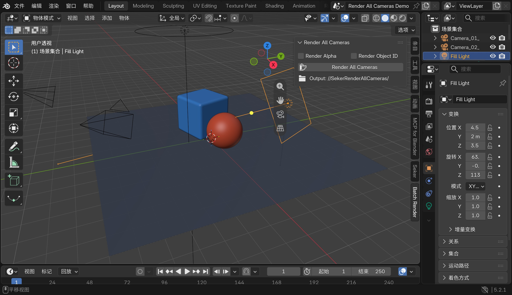

# Render All Cameras for Blender

**One-click batch rendering for every camera in a Blender scene.** Render still images with
automatic filenames, per-camera light/World environments, optional alpha masks, Object ID maps,
Material ID maps, and JSON manifests.

一键逐个渲染 Blender 当前场景中的全部摄影机，并自动输出规范命名的静帧、Alpha、Object ID、
Material ID 和 JSON 清单。

[](https://github.com/Seker800/SekerRenderAllCameras/releases/latest/download/camera_batch_renderer-0.6.0-blender-4.0.2.zip)
[](https://github.com/Seker800/SekerRenderAllCameras/releases/latest/download/camera_batch_renderer-0.6.0-blender-4.1.1.zip)
[](https://github.com/Seker800/SekerRenderAllCameras/releases/latest/download/camera_batch_renderer-0.6.0-blender-4.2.0.zip)
[](https://github.com/Seker800/SekerRenderAllCameras/releases/latest/download/camera_batch_renderer-0.6.0-blender-4.5-lts.zip)
[](https://github.com/Seker800/SekerRenderAllCameras/releases/latest/download/camera_batch_renderer-0.6.0-blender-5.2-lts.zip)

[](https://github.com/Seker800/SekerRenderAllCameras/releases/latest)
[](#whats-new-in-060-current-source)
[](#compatibility)
[](LICENSE)

> Download the package whose name exactly matches Blender 4.0.2, 4.1.1, 4.2.0, 4.5 LTS, or
> 5.2 LTS. Do not unzip it and do not substitute a package from another Blender line.
>
> The repository source is currently **0.6.0**. A release is complete only after all five links
> resolve to byte-for-byte matching assets in the latest GitHub Release.

## Plugin at a glance

[](Docs/images/plugin-quick-start.jpg)

Save the `.blend`, press <kbd>N</kbd> in the 3D Viewport, open **Batch Render**, choose the optional
Alpha/Object ID/Material ID outputs, and click **Render All Cameras**. The plugin renders every usable camera to
the fixed `SekerRenderAllCameras/` folder next to the saved `.blend`.

中文：保存 `.blend`，在 3D 视图按 <kbd>N</kbd>，打开 **Batch Render**；按需勾选 Alpha / Object ID / Material ID，
然后点击 **Render All Cameras**。上图只保留插件面板，点击可查看原始尺寸。

## What's new in 0.6.0 (current source)

- Publish five separately bounded packages for Blender 4.0.2, 4.1.1, 4.2.0, 4.5 LTS, and 5.2 LTS.
- Run the same background, GUI, stress, wrong-version, installed-package, and semantic-contract
  gates against every target; a pass on one Blender version cannot substitute for another.
- Require GitHub assets to match the SHA-256 of the locally tested packages before release closure.

中文：0.6.0 为五个 Blender 目标分别构建、测试和发布，不再提供模糊的通用包；发布后还会下载线上资产并与本地已测试包逐字节校验。

### Material ID included since 0.5.0

- Add an optional Material ID PNG for every camera. Each Blender Material receives a deterministic,
  non-black flat color; different material slots on the same mesh remain distinct.
- Surfaces without a material receive an explicit `Unassigned` color instead of disappearing into
  the black background.
- Write `{Blend}_MaterialID.json` with material keys, display names, exact RGB values, hex colors,
  and skipped geometry.
- Material ID rendering uses an isolated temporary Workbench scene and does not modify the user's
  materials, nodes, material slots, or face assignments.

中文：0.5.0 新增 Material ID 通道。同一材质在不同物体、摄影机和重复运行中保持同一颜色；同一模型的不同材质面会输出不同颜色；没有材质的表面使用单独的 `Unassigned` 标签。插件不会修改用户材质或面分配。

### Camera environments included

- Pair any camera with an optional light Collection, an optional Blender World, or both.
- Selecting a pairing immediately previews its camera, light rig, and World in the current scene.
- While a paired camera renders, only lights inside its paired Collection (including child
  Collections) are enabled; other scene lights are temporarily ignored. A paired Collection may be
  hidden or excluded before the run—the plugin reveals it when needed and restores that state later.
- Unpaired cameras keep the scene state captured at batch start. All render-time visibility and
  World changes are restored after completion, cancellation, or failure.
- Output still uses the fixed `SekerRenderAllCameras/` folder: new matching images replace old ones,
  while images not generated in the current run remain untouched.

中文：选中不同配对行会立即切换摄影机、灯组和 World。灯光 Collection 即使事先被隐藏或从 View Layer 排除，渲染时也会自动启用，完成、取消或失败后恢复任务开始时的状态。

### Verified in Blender

The Material ID workflow was exercised in Blender 5.2.1 with a multi-material mesh and an
unassigned-material object. The exported PNG contained only the black background and the three
exact colors declared in `MaterialID.json`; original material slots, face assignments, and material
colors remained unchanged. The environment workflow was also exercised with two cameras, two initially
hidden and View Layer-excluded light Collections, and two different Worlds. The real EEVEE run
produced two distinct PNGs, recorded each Camera/Collection/World combination in `RenderInfo.json`,
and restored the original camera, World, Collection, View Layer, and light visibility afterward.
The GUI regression run also completed a three-camera queue without stopping after the first image.

中文：上述配对并非只做了代码测试；项目已在 Blender 5.2.1 中实际创建场景、连续渲染并检查导出图片、RenderInfo 与渲染后的状态恢复。

## Why use it?

- Render every camera in the current Scene with one click—built for still images, not animation.
- Keep the current Blender render settings for Beauty output.
- Give each camera its own light Collection and World without duplicating the scene.
- Add an optional lossless grayscale Alpha mask for each camera.
- Add an optional exact-color Object ID map plus a machine-readable color mapping JSON.
- Add an optional exact-color Material ID map plus a machine-readable material mapping JSON.
- Name files from the `.blend` file, camera, channel, resolution, and render engine.
- Reuse one `SekerRenderAllCameras/` folder: newly rendered files replace matching old files, while
  outputs not generated in the current run remain untouched.
- Track progress, cancel cooperatively, record failures, and restore the active camera and settings.

Example filenames:

```text
ProductShot_Camera_Front_Beauty_1920x1080_Cycles.png
ProductShot_Camera_Front_Alpha_1920x1080.png
ProductShot_Camera_Front_ObjectID_1920x1080_Object.png
ProductShot_Camera_Front_MaterialID_1920x1080_Material.png
ProductShot_RenderInfo.json
ProductShot_ObjectID.json
ProductShot_MaterialID.json
```

## Install

### Blender 4.2.0, 4.5 LTS, or 5.2 LTS

1. Download the matching Extension ZIP from the five buttons at the top of this page.
2. In Blender, open **Edit → Preferences → Get Extensions**.
3. Open the top-right menu and choose **Install from Disk**.
4. Select the downloaded ZIP. Do not extract it first.

### Blender 4.0.2 or 4.1.1

1. Download the matching Legacy ZIP from the five buttons at the top of this page.
2. In Blender, open **Edit → Preferences → Add-ons**.
3. Click **Install…**, choose the downloaded ZIP, then enable **Render: Render All Cameras**.

## Quick start

1. Save the `.blend` file—the output location is based on it.
2. Put the mouse over the 3D Viewport and press <kbd>N</kbd>.
3. Open **Batch Render → Render All Cameras**.
4. Enable Alpha, Object ID, and/or Material ID if needed.
5. Optional: under **Camera Environments**, press **+**, choose a Camera, then choose a Light
   Collection and/or World. Child Collections are included automatically.
6. Click **Render All Cameras**.

Leave **Light Collection** blank to keep all scene lights. Leave **World** blank to keep the scene
World. A paired light Collection must belong to the current Scene; it may start hidden or excluded.
Each camera can have at most one pairing; unpaired cameras use the state captured at batch start.
Linked-library lights need editable library overrides because the plugin must temporarily change
their render visibility.

The same controls are also available under **Output Properties → Render All Cameras**. Results are
written next to the `.blend` file:

```text
MyProject/
├─ ProductShot.blend
└─ SekerRenderAllCameras/
   ├─ ...Beauty....png
   ├─ ...Alpha....png
   ├─ ...ObjectID....png
   ├─ ...MaterialID....png
   ├─ ...RenderInfo.json
   ├─ ...ObjectID.json
   └─ ...MaterialID.json
```

中文快速使用：Blender 4.2/4.5/5.2 下载对应 Extension 包并选择“从磁盘安装”；Blender
4.0.2/4.1.1 下载各自的 Legacy 包并从“插件”页安装。不要跨版本混用或解压 ZIP。保存
`.blend` 后，将鼠标放到 3D 视图并按
<kbd>N</kbd>，进入 **Batch Render** 标签即可开始批量渲染。

## Demo

Open [`examples/RenderAllCameras_Demo.blend`](examples/RenderAllCameras_Demo.blend) to try a small
two-camera acceptance scene. A complete run produces two Beauty images, two Alpha images, two
Object ID images, two Material ID images, `RenderInfo.json`, `ObjectID.json`, and `MaterialID.json`.

## Compatibility

| Environment | Status |
| --- | --- |
| Blender 4.0.2 | Tested; minimum supported version |
| Blender 4.1.1 | Tested |
| Blender 4.2.0 | Tested; first Extension version |
| Blender 4.5.13 LTS | Tested |
| Blender 5.2.1 LTS | Tested |
| Blender 4.0.0–4.0.1 and earlier | Not supported |
| Cycles, EEVEE, Workbench | Beauty and auxiliary channels supported |
| Third-party render engines | Beauty only by default |

This release does not claim open-ended compatibility. Each supported line has a
separate version-bounded package and release gate. Blender 4.0.2 and 4.1.1 use separate Legacy
packages; 4.2.0, 4.5 LTS, and 5.2 LTS use separate Extensions.

Object ID and Material ID do not currently include Volume objects. Animation, Cryptomatte,
Multiview, multi-Scene queues, and distributed rendering are outside the first release.

## Development and tests

```powershell
python -m unittest discover -s tests/unit -v
python -m unittest discover -s tests/architecture -v
uvx ruff check camera_batch_renderer tests scripts
blender --background --factory-startup --python scripts/run_blender_tests.py
blender --background --factory-startup --python scripts/run_environment_pair_acceptance.py
blender --background --factory-startup --python scripts/run_material_id_acceptance.py
powershell -ExecutionPolicy Bypass -File scripts/build_extension.ps1
```

The test suite covers naming, natural camera order, per-camera light/World switching, fixed-folder
preservation and manifests, state restoration, cancellation, handled failures, Alpha/Object ID
and Material ID pixels, Blender 4.0.2/4.1/4.2/4.5/5.2 integration, both package formats,
installed-package rendering, and UI registration.

Architecture and implementation documentation lives in [`Docs/`](Docs/README.md). The original
product scope is recorded in [`PLAN.md`](PLAN.md).

## License

Copyright © 2026 Seker800. Released under
[`GPL-3.0-or-later`](LICENSE), consistent with the Extension manifest.

<!-- Search terms: Blender addon, Blender extension, batch render all cameras, multi-camera render,
still image renderer, alpha mask, object ID map, render automation, Python bpy. -->
